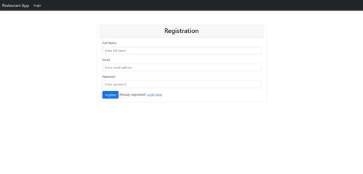
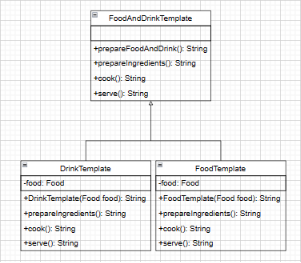

**CHAPTER 1: TOPIC DETAILS**

1. **Reasons for choosing the topic**

The application of ordering food in a buffet restaurant has many important roles. First, it saves customers time and enhances the restaurant experience. Customers can preview the restaurant's menu and choose what they want to eat before going there, making the dining process more convenient and not having to wait in long lines to get their food. In addition, the application also helps restaurants manage the number of dishes prepared more efficiently, avoiding food waste and minimizing leftovers. The application also has many other benefits such as increasing food safety and hygiene, saving personnel costs, increasing revenue for restaurants, improving customer experience and increasing management efficiency. Thanks to this app, restaurants can collect information about customers' preferences and eating habits to improve service quality and increase customer retention. In short, the buffet restaurant food ordering application is a useful tool to enhance the customer experience and improve the management efficiency for the restaurant.

1. **Demo**

***a. Login And Register page***

Figure 1. Registration Form

Describe: Screen used for user register.

Figure 2. Login Form

Describe: Screen used for user register.

***b. Customer Page***

Figure 3. Home Page

Describe: Screen used for user to see the home page.

Figure 4. Menu Food Page

Describe: Screen used for user to see the menu food page.

Figure 5. Booking Table Page

Describe: Screen for the user to place the curtain and close the table.

Figure 6. History Page

Describe: Screen for the user to see history: Bill, Booking, Deposit.

Figure 7. Deposit Page

Describe: screen for the user to top up the account. Depending on the method of loading, users will enjoy the following incentives:

\+ Bank Payment (+1%)

\+ Cash Payment (+0%)

\+ Credit Card Payment (+2%)

Figure 8. Information Page

Describe: screen to edit user information and view the amount in the account.

***c. Admin Page***

Figure 9. Manager User Page

Describe: screen for admin to manage users.

Figure 10. Manager Food Page

Describe: screen for admin to manage foods and chef can see stage of food and drink.

Figure 11. Manager Table Page

Describe: screen for admin to manage table.

Figure 12. Manager Bill History Page

Describe: screen for admin to manage bill.

Figure 13. Manager Booking History Page

Describe: screen for admin to manage booking history of all users.

Figure 14. Manager Deposit History Page

Describe: screen for admin to manage deposit history of all users.

Figure 15. Manager Review History Page

Describe: screen for admin to manage review history of all users.

**CHAPTER 2: ARCHITECTURAL DESIGN**

Restaurant Application use Spring Boot for code

Spring Boot is an open-source Java-based framework used for building standalone, production-grade Spring applications with minimal configuration. It is a part of the Spring framework and was developed to simplify and streamline the development process.

Spring Boot provides a set of pre-configured dependencies and opinionated configuration to help developers quickly set up and run their applications. It also includes an embedded web server, making it easy to create and deploy web applications.

Some of the key features of Spring Boot include:

1. Auto-configuration: Spring Boot provides pre-configured dependencies and automatically configures the application based on the dependencies it finds on the classpath.
1. Starter dependencies: Spring Boot includes starter dependencies that provide a quick and easy way to add commonly used libraries and frameworks to an application.
1. Embedded web server: Spring Boot includes an embedded web server, making it easy to create and deploy web applications without the need for an external server.
1. Actuator: Spring Boot Actuator provides endpoints and tools for monitoring and managing the application, such as health checks, metrics, and logging.
1. Devtools: Spring Boot Devtools provides tools for faster development, including automatic restarts, live reload, and remote debugging.

Popular Applications use Spring Boot: Netflix, Uber, Alibaba, SoundCloud, Zalando, Deliveroo 

Overall, Spring Boot simplifies the development process, reduces the amount of boilerplate code, and allows developers to focus on writing business logic instead of configuration.

The directories include:

- config: configure and stream access for security in Spring Security
- controller: contains intermediate classes that navigate the model and view for the project
- process: directory of functions and contains design patterns for processing functionality
- repository: contains access to the database for each entity
- service: contains intermediate classes between Controller and Repository. It contains the methods that handle the business logic of the application. Services are often used to reduce dependencies between application components and increase code reuse.
- templates: 

**CHAPTER 3: DETAILED DESIGN**

1. **List of Design Patterns Used**

|STT|Design pattern name|Function Summary|
| :- | :- | - |
|1|Model-View-Controller Pattern|A widely-used design pattern in software engineering that separates an application into three interconnected components: the model, the view, and the controller.|
|2|Builder Pattern|When a user reviews or makes a reservation, there will be an invoice generated and the Builder Pattern is used for creating and storing review invoices and booking invoices.|
|3|Command Pattern|When the user requests to order, the Command Pattern is the action to order the food and perform the action to store it in the Bill|
|4|Decorator Pattern|When the user requests to order and choose the accompanying topping, the Decorator Pattern is the action to write the Toppings in the Bill so that the manager receives the Bill and delivers the required topping food.|
|5|Factory Pattern|There are 3 different types of customers with discounts (Bronze, Silver, Gold), Factory Method has a function to sort by the total amount in their booking history|
|6|Singleton Pattern|Bill has many different states, so using Singleton is used to set up notification to the customer about the status of the dish. For example "Ordered", "Cooking",...|
|7|Strategy Pattern|When depositing with different methods (Cash, BankAccount, CreditCard) will enjoy different promotions, the Strategy Pattern is used to initialize those objects according to the method that the customer chooses to deposit.|
|8|Template Method Pattern|There are 2 types of food, Food and Drink in the restaurant, and the steps to make Food and Drink are different, so Template Method is used to show those steps for the chef to see.|

1) ***Model-View-Controller***

When using MVC for database, there are many benefits as follows:

1. Separation of concerns: The MVC pattern separates the concerns of an application into three distinct parts. This makes it easier to develop, maintain, and test the application code.
1. Code reusability: The separation of concerns in the MVC pattern makes it easier to reuse code. Developers can reuse the model, view, and controller components across different applications or within the same application.
1. Scalability: The MVC pattern makes it easier to scale an application. Developers can add or modify the components of the application without affecting the other components.
1. Increased productivity: By separating the concerns of an application, developers can work on different parts of the application at the same time. This increases productivity and reduces the time required to develop the application.
1. Improved maintainability: The separation of concerns in the MVC pattern makes it easier to maintain an application. Developers can modify or replace a component without affecting the other components.

2) ***Factory Method***

Using Factory Method for customer classification in an application can bring many benefits, including:

1. Flexibility: The Factory Method pattern allows for flexibility in object creation because it defines an interface for creating objects, but allows subclasses to determine the concrete implementation. This means that you can easily add new types of objects without having to modify the existing code.
1. Logical separation: By separating the object creation logic from the rest of the code, the Factory Method pattern provides a clear separation of concerns. This makes it easier to maintain and modify the code because changes to the object creation logic won't impact the rest of the code.
1. Independence from other components: Because the Factory Method pattern defines an interface for creating objects, it allows for greater independence between components. Each component can use the Factory Method to create the objects it needs without having to rely on other components.
1. Speed up development: The Factory Method pattern can speed up development because it allows developers to reuse existing code to create new objects. This means that developers can focus on creating the unique aspects of the new object, rather than having to start from scratch.
1. Reduce errors: By centralizing the object creation logic, the Factory Method pattern can help reduce errors because it ensures that all objects are created using the same logic. This can help to prevent inconsistencies or errors that might occur if each component were responsible for creating its own objects.

3) ***Builder***

Using the Builder design pattern for automated invoice generation and reviews can offer many benefits, including:

1. Flexibility: With the Builder design pattern, we can easily create various invoice and automated review objects from different components. This makes the system flexible and scalable.
1. Logical separation: The Builder design pattern helps to separate the logic of object initialization and object properties. This makes the source code more manageable and easy to maintain.
1. Independence from other components: Using the Builder design pattern makes it possible for invoice and evaluation objects to be automatically created independently of other components in the system. This makes the system easier to test and debug.
1. Speed up development: Using the Builder design pattern helps speed up system development. With Builder, we can create objects quickly and easily, reducing development time.
1. Reduce Errors: With Builder, object properties are defined correctly, which helps to reduce errors during object initialization.

4) ***Command***

Using the Command design pattern for automatic billing can provide many benefits, including:

1. Flexibility: With the Command design pattern, billing requests can be handled flexibly and easily. It allows us to add or remove new billing requests without affecting existing billing requests.
1. Logical separation: The Command design pattern separates the logic of handling requests and executing them. This makes the source code more manageable and easy to maintain.
1. Independence from other components: Using the Command design pattern allows billing requests to be handled independently of other components in the system. This makes the system easier to test and debug.
1. Increase reusability: The Command design pattern increases the reusability of source code. Billing requests are encapsulated into Command objects, which can be reused in different scenarios.
1. Reduce Errors: With Command, billing requests are handled accurately, helping to reduce errors in the billing process.

1) ***Decorator***

Using the Decorator design pattern for customizing dishes and adding toppings can bring many benefits, including:

1. Flexibility: With the Decorator design pattern, we can customize the dish or add topping flexibly and easily. We can apply many different decorators to an object and change them depending on the customer's requirements.
1. Logical separation: The Decorator design pattern helps separate the logic of handling dishes and toppings. This makes the source code more manageable and easy to maintain.
1. Independence from other components: Using the Decorator design pattern allows dishes and toppings to be handled independently of other components in the system. This makes the system easier to test and debug.
1. Increase reusability: The Decorator design pattern increases the reusability of source code. The decorators can be reused for different objects in the system.
1. Minimize Errors: With Decorator, dish customizations and toppings are handled accurately, helping to reduce errors in the ordering process.

5) ***Singleton***

Using the Singleton design pattern for state setting for bills can bring many benefits, including:

1. Create a single object: With the Singleton design pattern, we can create a single object for setting the state of the bill. This helps to reduce errors that occur when there are many objects that work with the bill's data.
1. Easy access to data: With the Singleton design pattern, we can easily access the bill's data from anywhere in the system without having to pass data back and forth between other objects. together.
1. Ensure data consistency: Singleton design pattern ensures consistency of bill's data. Because there is only one object to manage the state of the bill, the data of the bill will be updated and accessed accurately and consistently.
1. Saving resources: With the Singleton design pattern, we can save computer resources by creating only a single object for setting the state of the bill instead of creating many different objects.
1. Easy to extend and maintain: Using the Singleton design pattern makes it easier to extend and maintain the system. Because there is only one object that manages the state of the bill, when adding or modifying the function of the bill, we only need to modify a single object without affecting other objects in the system.

6) ***Strategy***

When using Strategy for a variety of deposit methods, there are many benefits as follows:

1. Flexibility: Strategy allows to change the deposit method without affecting the main source code. With the details of the deposit form separate, we can easily change them without affecting the rest of the program.
1. Easy maintenance and testing: Each deposit strategy is an independent object, so it can be tested and maintained independently of other strategies. This makes maintenance and testing easier.
1. Scalability: When we want to add a new deposit form, we just need to create a new strategy without modifying the code of other deposit strategies.
1. Reduce dependency: By separating the details of the deposit form into separate objects, we reduce the dependency of the program on a particular deposit form.

7) ***Template Method***

When using the Template Method for detailed processing information, there are many benefits as follows:

1. Flexibility: The Template Method allows subclasses to change or extend processing steps easily without affecting other steps. This reduces dependencies between classes and increases program flexibility.
1. Code reuse: The Template Method allows common steps of the processing to be reused between subclasses. This reduces the amount of code being rewritten and reduces development time.
1. Minimize Errors: The Template Method helps to ensure that the processing steps are performed correctly and are consistent across subclasses. This helps to reduce errors and increase program accuracy.
1. Ease of maintenance: The Template Method helps to separate the common steps of the processing process into separate methods, making maintenance and modification easier.

1. **Class Diagram**

Figure 16. MVC Pattern

Figure 17. Builder Pattern Class Diagram

Figure 18. Command Pattern Class Diagram

Figure 19. Decorator Pattern Class Diagram

Figure 20. Factory Method Pattern Class Diagram

Figure 21. Singleton Pattern Class Diagram

Figure 22. Strategy Pattern Class Diagram

Figure 23. Template Method Class Diagram

1. **LINK TO VIDEO DEMO**

https://youtu.be/crJecN\_XSC8
